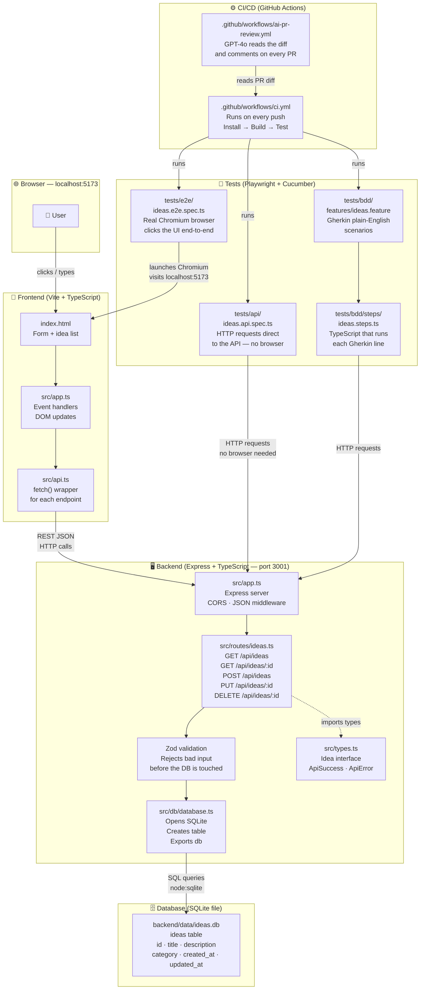

# 💡 Full-Stack Agentic Testing — Idea Journal

[](https://github.com/rayme11/full-stack-agentic-testing/actions/workflows/ci.yml)

A **step-by-step, beginner-to-professional learning project** covering full-stack TypeScript development, modern QA engineering, and AI-assisted testing workflows.

> **Topic:** "Idea Journal" — a simple CRUD app where you capture, organize, and retrieve learning ideas. Simple enough to follow, powerful enough to teach every concept.

---

## 🗺 Learning Path

| Step                                      | Topic                          | What You Build                                         |
| ----------------------------------------- | ------------------------------ | ------------------------------------------------------ |
| [01](./docs/STEP_01_PROJECT_SETUP.md)     | Project Setup & TypeScript     | Monorepo, VS Code config, TypeScript basics            |
| [02](./docs/STEP_02_BACKEND_API.md)       | Backend API                    | Express + TypeScript + SQLite REST API                 |
| [03](./docs/STEP_03_FRONTEND_UI.md)       | Frontend UI                    | HTML + CSS + TypeScript with Vite                      |
| [04](./docs/STEP_04_PLAYWRIGHT_TESTS.md)  | Playwright Testing             | E2E browser tests + API tests                          |
| [05](./docs/STEP_05_BDD_GHERKIN.md)       | BDD with Gherkin               | Cucumber.js + feature files                            |
| [06](./docs/STEP_06_GITHUB_ACTIONS_AI.md) | GitHub Actions & AI            | CI/CD pipelines + GPT-4o PR review                     |
| [07](./docs/STEP_07_AUTONOMOUS_AGENTS.md) | Autonomous Multi-Agent Systems | AutoGen agents that build & test a full app end-to-end |

**Start here → [Step 01: Project Setup](./docs/STEP_01_PROJECT_SETUP.md)**

---

## 🏗 Architecture

> This diagram shows how every piece of the project fits together — from the browser all the way down to the database, and how tests and CI/CD plug in.



### How a single request flows through the system

```
Browser                 Frontend              Backend                  Database
  │                        │                     │                        │
  │── user clicks "Add" ──▶│                     │                        │
  │                        │── POST /api/ideas ─▶│                        │
  │                        │   {title, desc, cat} │                        │
  │                        │                     │── Zod validates body   │
  │                        │                     │── INSERT INTO ideas ──▶│
  │                        │                     │◀─ {lastInsertRowid}    │
  │                        │                     │── SELECT WHERE id = ? ▶│
  │                        │◀── 201 {data: idea} ─│◀─ row ─────────────── │
  │◀── new card appears ───│                     │                        │
```

---

## 🚀 START HERE — Open the Project in VS Code

> This project is designed to be worked through **step by step in VS Code**.
> Do not just clone and run — follow the guided learning path below.

```bash
# 1. Clone the repo
git clone https://github.com/rayme11/full-stack-agentic-testing.git
cd full-stack-agentic-testing

# 2. Open the VS Code WORKSPACE file (not just the folder!)
code idea-journal.code-workspace
```

When VS Code opens, **install the recommended extensions** when prompted.

Then open **[`LEARNING_PATH.md`](./LEARNING_PATH.md)** — that is your step-by-step checklist.

---

## ⚡ Quick Start (after VS Code workspace is open)

### Prerequisites

- **Node.js 22+** — https://nodejs.org _(required for built-in SQLite)_
- **npm 9+** — included with Node.js
- **Git** — https://git-scm.com
- **VS Code** — https://code.visualstudio.com

### 1. Clone & Open the Workspace

```bash
git clone https://github.com/rayme11/full-stack-agentic-testing.git
cd full-stack-agentic-testing

# Open the WORKSPACE file (not just the folder!)
code idea-journal.code-workspace
```

### 2. Install Extensions

Accept the prompt to install recommended extensions, or press `Ctrl+Shift+P` → "Extensions: Show Recommended Extensions".

### 3. Follow the Learning Path

Open **[`LEARNING_PATH.md`](./LEARNING_PATH.md)** and work through each step.

### 4. Set Up Environment

```bash
cp .env.example .env
# Defaults work for local development
```

---

## 📁 Project Structure

```
full-stack-agentic-testing/
├── .github/
│   ├── workflows/
│   │   ├── ci.yml               ← CI: build + test pipeline
│   │   └── ai-pr-review.yml     ← AI PR review with GPT-4o
│   ├── ISSUE_TEMPLATE/
│   ├── PULL_REQUEST_TEMPLATE.md
│   └── copilot-instructions.md  ← GitHub Copilot guidance
├── backend/                     ← Express + TypeScript + SQLite
│   └── src/
│       ├── app.ts               ← Express entry point
│       ├── types.ts             ← Shared TypeScript interfaces
│       ├── db/database.ts       ← SQLite connection + schema
│       └── routes/ideas.ts      ← REST API route handlers
├── frontend/                    ← Vite + TypeScript + HTML + CSS
│   ├── index.html
│   └── src/
│       ├── app.ts               ← UI controller
│       ├── api.ts               ← API client (fetch wrapper)
│       └── style.css
├── tests/                       ← All test files (TypeScript throughout)
│   ├── playwright.config.ts     ← Playwright configuration
│   ├── cucumber.json            ← Cucumber BDD configuration
│   ├── api/ideas.api.spec.ts    ← Playwright API tests
│   ├── e2e/ideas.e2e.spec.ts    ← Playwright E2E tests
│   └── bdd/
│       ├── features/ideas.feature ← Gherkin scenarios
│       └── steps/ideas.steps.ts   ← TypeScript step definitions
├── docs/                        ← Step-by-step learning documentation
│   ├── STEP_01_PROJECT_SETUP.md
│   ├── STEP_02_BACKEND_API.md
│   ├── STEP_03_FRONTEND_UI.md
│   ├── STEP_04_PLAYWRIGHT_TESTS.md
│   ├── STEP_05_BDD_GHERKIN.md
│   ├── STEP_06_GITHUB_ACTIONS_AI.md
│   └── STEP_07_AUTONOMOUS_AGENTS.md
├── scripts/
│   └── ai_pr_review.py          ← GPT-4o PR review script
├── tsconfig.json                ← Root TypeScript project references
├── package.json                 ← npm workspace root
├── requirements.txt             ← Python dependencies (AI scripts)
├── .env.example                 ← Environment variable template
└── .gitignore
```

---

## 🛠 Tech Stack

| Layer       | Technology                                  | Why                                                    |
| ----------- | ------------------------------------------- | ------------------------------------------------------ |
| Language    | **TypeScript** (strict mode)                | Type safety, IDE intelligence, industry standard       |
| Backend     | **Node.js + Express**                       | Simple, widely used, great for learning REST APIs      |
| Database    | **SQLite** (Node.js built-in `node:sqlite`) | Zero setup, no native compilation, built into Node 22+ |
| Validation  | **Zod**                                     | Runtime type validation that matches TypeScript types  |
| Frontend    | **HTML + CSS + TypeScript**                 | Fundamentals first, no framework magic                 |
| Build tool  | **Vite**                                    | Instant hot reload, fast TypeScript transpilation      |
| E2E Testing | **Playwright**                              | Modern browser + API testing (replaced Selenium)       |
| BDD         | **Cucumber.js**                             | Gherkin feature files for human-readable tests         |
| CI/CD       | **GitHub Actions**                          | Free, built into GitHub, industry standard             |
| AI Review   | **OpenAI GPT-4o**                           | Automated PR review and code suggestions               |

---

## 📚 API Reference

### Base URL: `http://localhost:3001`

| Method   | Endpoint         | Description       | Status    |
| -------- | ---------------- | ----------------- | --------- |
| `GET`    | `/health`        | Health check      | 200       |
| `GET`    | `/api/ideas`     | Get all ideas     | 200       |
| `GET`    | `/api/ideas/:id` | Get idea by ID    | 200 / 404 |
| `POST`   | `/api/ideas`     | Create a new idea | 201 / 400 |
| `PUT`    | `/api/ideas/:id` | Update an idea    | 200 / 404 |
| `DELETE` | `/api/ideas/:id` | Delete an idea    | 204 / 404 |

### Request Body (POST / PUT)

```json
{
  "title": "Learn TypeScript",
  "description": "Study generics and utility types",
  "category": "backend"
}
```

### Categories

`general` · `frontend` · `backend` · `testing` · `devops` · `ai`

---

## � Step 7 — Autonomous Multi-Agent Development (Advanced)

> **Prerequisite:** Complete Steps 1–6 first. You need to understand what the agents are building before you watch them build it.

This step moves beyond single-model AI assistance (like GitHub Copilot) into **true agentic AI** — multiple specialized AI agents working together autonomously to scaffold, implement, and validate a full-stack application from a plain English prompt.

### What Is a Multi-Agent System?

Instead of one AI answering questions, you have a **team of AI agents**, each with a defined role, that communicate with each other through a **coordinator** (also called an orchestrator). Think of it like a software team:

```
┌──────────────────────────────────────────────┐
│              👤 Human Prompt                  │
│   "Build a Notes app with Express + SQLite,  │
│    a Vite frontend, and Playwright tests"    │
└────────────────────┬─────────────────────────┘
                     │
                     ▼
┌──────────────────────────────────────────────┐
│         🧠 Coordinator Agent                  │
│    Orchestrates the plan, delegates tasks,   │
│    validates each agent's output before      │
│    passing it to the next agent              │
└──┬────────────┬────────────┬─────────────────┘
   │            │            │
   ▼            ▼            ▼
┌──────┐  ┌──────────┐  ┌──────────────┐
│  🏗  │  │   🎨     │  │     🧪       │
│ API  │  │Frontend  │  │   Testing    │
│Agent │  │  Agent   │  │    Agent     │
│      │  │          │  │              │
│Writes│  │ Writes   │  │ Writes       │
│Express│ │HTML/TS   │  │ Playwright   │
│routes│  │+ Vite    │  │ API + E2E    │
│+ SQLite│ │ config  │  │ + BDD steps  │
└──────┘  └──────────┘  └──────────────┘
```

### Technology: AutoGen (Microsoft)

This project uses **[AutoGen](https://github.com/microsoft/autogen)** — Microsoft's open-source framework for building multi-agent AI systems in Python.

Key concepts you will learn:

- **`AssistantAgent`** — an AI agent backed by an LLM (GPT-4o, Claude, etc.)
- **`UserProxyAgent`** — an agent that can execute code on your machine
- **`GroupChat` + `GroupChatManager`** — the coordinator that routes messages between agents and enforces turn order
- **Tool use** — agents can call functions (write files, run shell commands, call APIs)
- **Reflection** — agents review each other's outputs and request corrections before moving on

### What the Agents Will Build End-to-End

Given only this prompt:

> _"Create a Todo app using Node.js + Express + SQLite for the backend, a plain HTML/TypeScript/Vite frontend, and Playwright tests covering all CRUD operations. Follow the conventions in this project."_

The agent pipeline will:

1. **Coordinator** reads the prompt, breaks it into tasks, and creates a shared execution plan
2. **API Agent** scaffolds the Express app, database schema, and all route handlers — writes files to disk
3. **Frontend Agent** reads the API agent's output, then scaffolds `index.html`, `api.ts`, and `app.ts`
4. **Testing Agent** reads both outputs, generates Playwright API tests, E2E tests, and Gherkin BDD scenarios
5. **Coordinator** runs `npx tsc --noEmit` and `npm run test:api` to validate the output — if they fail, it sends error messages back to the responsible agent for correction (retry loop)
6. A final **Review Agent** critiques the generated code for security issues (XSS, SQL injection, missing validation) and suggests fixes

### Scripts Location

```
scripts/
├── agents/
│   ├── coordinator.py      ← GroupChatManager + orchestration logic
│   ├── api_agent.py        ← Backend scaffolding agent
│   ├── frontend_agent.py   ← Frontend scaffolding agent
│   ├── test_agent.py       ← Test generation agent
│   └── review_agent.py     ← Security & quality review agent
└── run_agents.py           ← Entry point — run this to start the pipeline
```

### How to Run

```bash
# 1. Activate your Python virtualenv (or use the project requirements.txt)
pip install -r requirements.txt

# 2. Set your OpenAI API key
export OPENAI_API_KEY=sk-...

# 3. Run the full multi-agent pipeline
python scripts/run_agents.py \
  --prompt "Build a Todo app with Express, SQLite, Vite, and Playwright tests" \
  --output ./agent-output/

# 4. Watch the agent conversation in your terminal — each message is one agent
#    talking to another through the coordinator.
```

### What Makes This Different from a Simple Script?

| Single Script            | Multi-Agent System                       |
| ------------------------ | ---------------------------------------- |
| One LLM call, one output | Multiple agents, iterative refinement    |
| No validation loop       | Agents verify each other's work          |
| No specialization        | Each agent has focused context and role  |
| Fails silently           | Coordinator detects failures and retries |
| You direct every step    | You give a goal — agents plan the steps  |

> **Read the full guide → [`docs/STEP_07_AUTONOMOUS_AGENTS.md`](./docs/STEP_07_AUTONOMOUS_AGENTS.md)**

---

## �🤝 Contributing

1. Read the [Copilot instructions](.github/copilot-instructions.md) for coding conventions
2. Open an [issue](.github/ISSUE_TEMPLATE/feature_request.md) describing your change
3. Create a feature branch: `git checkout -b feature/my-change`
4. Make your changes with TypeScript and tests
5. Open a Pull Request — the AI review will automatically post feedback

---

## 📄 License

MIT — see [LICENSE](./LICENSE)
